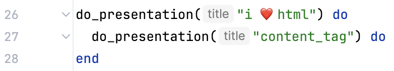

<!-- _class: renuo -->

# HTML I ❤️ U
A debugging journey

##### 2025-02-27 by Alessandro Rodi

---

# Disclaimer

At the time of writing, the bug is still unresolved.

---

# This does not look good

---

# pill_button.html.erb

---

# Rendered HTML

---

# pill_button.html.erb

---

# node.html.erb

---

# First step: reproduce the bug

I have it here, right now. In front of me.

---

# First step: reproduce the bug

✅

---

# Second step: write a test (regression test)

In this case I cannot reliably reproduce it: the bug does not happen when I write tests. The generated HTML is always correct.

---

# Second step: write a test

---

# Third step: be misled by false-friends

Unfortunately I solved a very similar case just few hours before. Let me tell you about "content_tag".

or: the presentation within the presentation

---

# I had this 5 times

---

# Let's extract it

 

 

Start always by defining how you want to use your interfaces. 
How should it look like from outside?

---

# Rendered HTML

---

---

---

---

---

> Rails processes the block and implicitly renders its content before passing it to your helper.

> The block content gets implicitly added to the output buffer before it is even passed to error_block.

> `capture` stores the block's output as a SafeBuffer without rendering it immediately.

---

DEMO

* Show example with 10.times
* Show what happens with and without `=`
* show the rendered source of erb (which is not expected)
* Show the implementation of capture

---

# THM

Dig deeper into the topics. Don't scrape the surface and move on.

I think is ok to not dig deeper into topics you are not interested in, but coding is fun, you should to be interested in it.

---

# Let's go back to the original problem

---

# Real third step: simplify

---

---

---

Such an important step! Probably the most important.
I see often people debugging in very complex scenarios and dealing with a lot of complexity and usually my first suggestion is:

> SIMPLIFY. NARROW IT DOWN TO A SIMPLER VERSION TO FOCUS ON THE PROBLEM. REMOVE EVERYTHING AROUND IT.

---

# The problem persists

After adding `capture` to the wrapping block the problem persisted.

---

# Can I nest a `div` under a `a` tag?

Yes, I can.

---

# Why do my tests pass?

My rendered HTML is wrong but the returned HTML in the tests is correct.
Is there a mismatch?

---

# Returned HTML

---

# Rendered HTML

---

# Valid HTML

---

# Rendered HTML

---

# Solution

Do not use `p` for paragraphs. 

---
<!-- _class: renuo -->

# Thank You

# 

