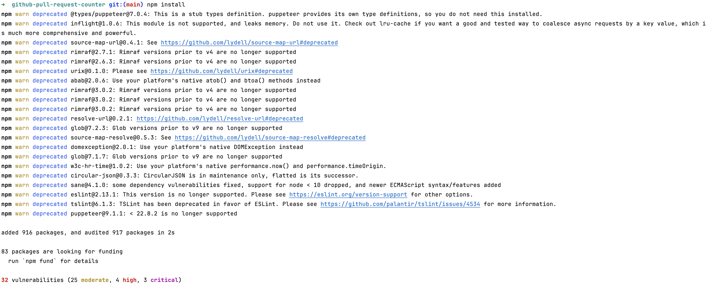
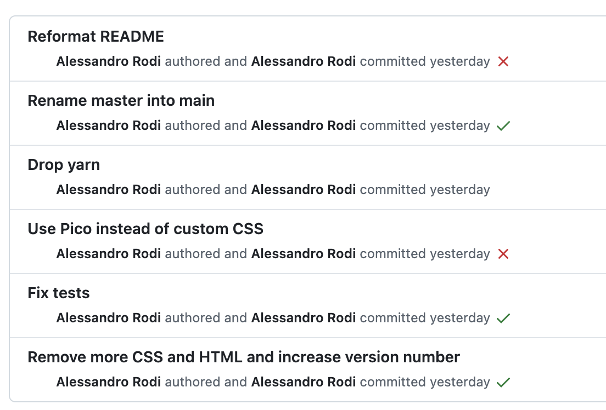
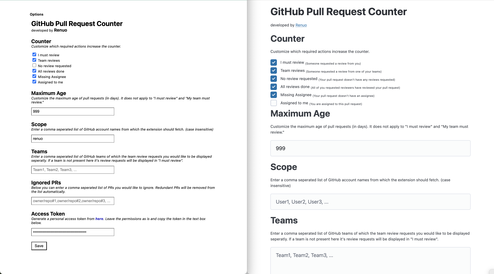
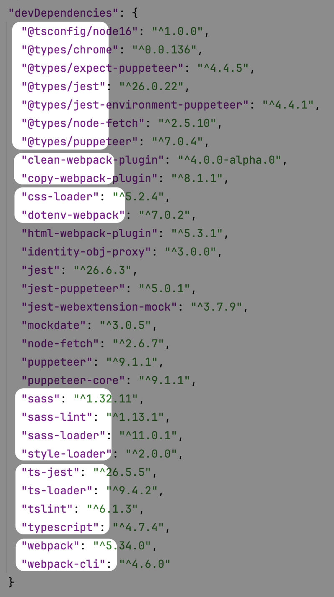
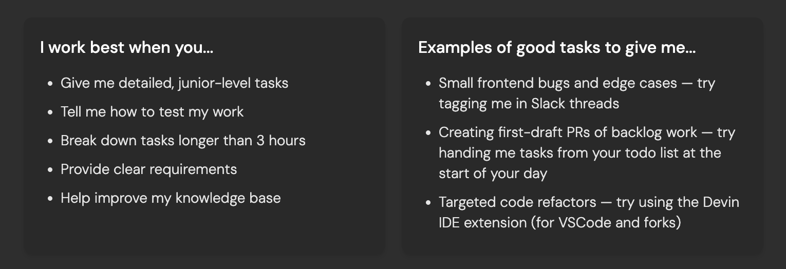
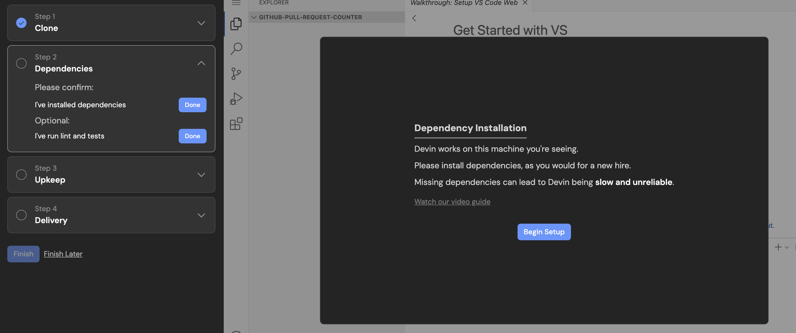
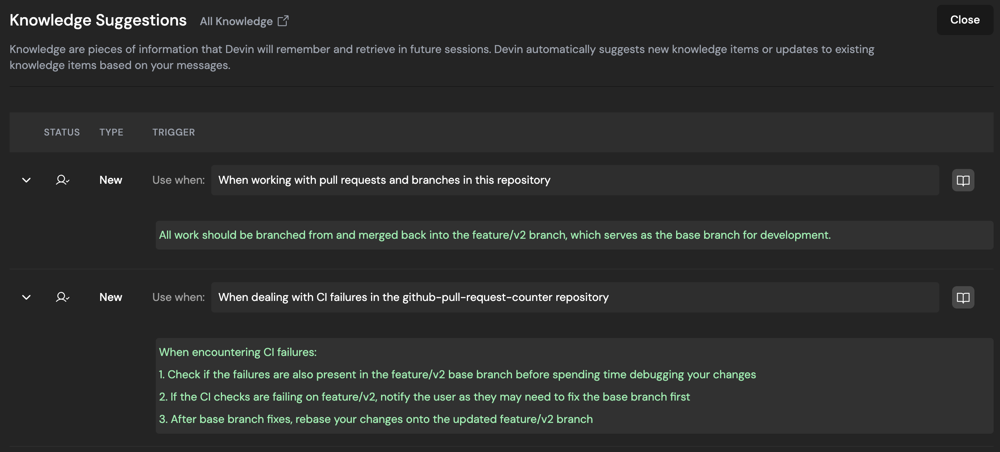

<!-- _class: renuo -->

# A day with Devin
My findings after spending few hours working with Devin

##### 2025-01-21 by Alessandro Rodi

---

# Github Pull Requests Counter

An IPA project from Janis from 2021

It shows a counter in your Browser to alert you if a code review is needed from you.

It's one of the most important pieces of the Work flow at Renuo.

---

# Github Pull Requests Counter

Providing a code review when requested has always the highest priority.

Please be diligent about the Pull Request Counter. Only if we work collaboratevily we can be successful and yes, sometimes other people work should come first.

---

# Github Pull Requests Counter

I decided to refresh the look & feel

---

# Github Pull Requests Counter

---

# Clean up

#noyarn

---

# Nice!

---

# What's next?

I want to work on a simple project. Here is a full list of what we can get rid of:

* typescript
* scss
* a lot of custom CSS
* webpacker

...and setting up the project and working on it should become pretty simple.

---

# #noblaming

This makes 100% sense in the context of an IPA project.
  
Because you want to show off

---

# Who is going to do it?

There's a total of **zero** fun in this task.

---

First thought went to my beloved ❤️ team-mates

but I needed their brain on serious stuff.

---

<h1 style="text-align: center">
It's time to AI-offshore tedious tasks

---

Devin costs 500$/month for a maximum of 250 ACUs  (Agent Compute Units)

---

Whatever this means

---

Some initial explanation

---

Project setup

---

Improves it's knowledge

---

First task: remove SASS

https://app.devin.ai/sessions/544cacda300b437e96030be64e6fbff2

---

# First blocker

No access to SemaphoreCI logs.

It's possible to instruct it how to access them via Browser.

Semaphore allows only login via Github and I did not want to type my username and password (also I have 2FA anyway...)

So I fixed the tests and told to continue

---

And I got my first PR! 🎉

https://github.com/renuo/github-pull-request-counter/pull/52

---

Second task: remove a single Typescript file

https://app.devin.ai/sessions/f47e78bd120d4119b09f932ef833147b

It learned new stuff as well.

---

Third task: change the look and feel to be similar to Github Pull Requests Overview

https://app.devin.ai/sessions/4dad461262d747659f733a0ae4892957

PR is pending: https://github.com/renuo/github-pull-request-counter/pull/55

---

Subsequent tasks have been to setup Github Actions so that it can read the failing tests on the PR and not ask me anymore.

After that he got more tasks to remove Typescript, some successful, some not.

https://github.com/renuo/github-pull-request-counter/pulls?q=is%3Apr+is%3Aclosed

---

# And now a Rails project

What's the most annoying task you might have to do in a Rails project 

no...is not renaming a class.

---

https://app.devin.ai/sessions/201a593845f94386a1a0a44e5f20ba35

and here we have a second, bigger, problem.

---

# Take Home Message

It's an amazing technology that I believe we should integrate.

It could be used to delegate all small, tedious tasks.

(not the simple tasks, the boring ones)

It's very cheap when it works: https://app.devin.ai/settings/usage

---

# Will it steal my job?

---

# No

---

# This is just a code monkey. 

---

# If you don't have profound technical skills this tool is useless.

---

# It's missing all the human interaction part of developing Software which matters a lot.

---

# Learn to talk with customers

---

# Improve your language skills

---

# Improve your consulting skills

---

# Learn from your experience and the experience of your peers.

---

# You are a Software Engineer

Engineering Software goes well beyond writing code. 

Your job is to create valuable Software for people.

Your job is to reason about the best way to make the Software valuable.

---

# Devin will not go out for lunch with a customer to discuss their ideas and projects for a long time. 

And that's what they are paying for. Not a code monkey.

---

<!-- _class: renuo -->

# Thank You

# 

