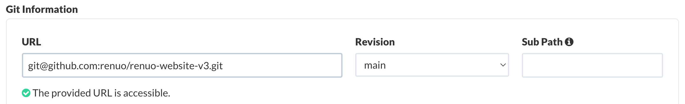
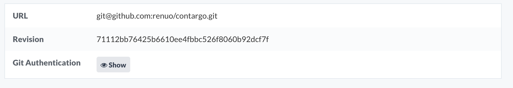

<!-- _class: renuo -->

# Deploio CD

How to deploy after CI passes

##### 2024-09-19 by Simon I.

--- 

https://docs.nine.ch/docs/deplo-io/getting-started-with-deploio
> Deploio is a fully managed app platform where you just bring the source code of your web application and it'll take care of building and deploying it continously.

---

# Tests?

What if I want to deploy only after my CI passes?

---

# Revision-based deployment

- By default a branch is set as the revision
- Read access to repository using a GitHub deploy key



---

# 💡 Instead of a branch, we can specify a commit as the revision

---



-> Deploio clones the repo at exactly this state

---

# But, now we need to update this revision...

---

<style scoped>
* {
  text-align: center;
}

img {
  margin: 30px 30px 0 0;
}
</style>

# Deploio x Semaphore

 

---

# Step 1: Install nine CLI

_develop-deploy.yml_
```yaml
checkout --use-cache

echo "deb [trusted=yes] https://repo.nine.ch/deb/ /" | sudo tee /etc/apt/sources.list.d/repo.nine.ch.list
sudo apt-get update && sudo apt-get install nctl
```

---

# Step 2: Authenticate per project

_develop-deploy.yml_
```yaml
...
nctl auth login --api-token=$DEPLOIO_API_TOKEN --organization=$DEPLOIO_ORG
```

- Global service account per organisation is WIP

---

_develop-deploy.yml_
```yaml
...
nctl update app $DEPLOIO_APP_NAME 
    --project $DEPLOIO_PROJECT 
    --git-revision=$(git rev-parse develop) 
    --build-env="RUBY_VERSION=$(cat .ruby-version)" 
    --skip-repo-access-check
```

- `skip-repo-access-check` is required, due to an internal issue (open bug report)

---

# Issues

- Service account per project required
- No response from Deploio -> state of deployment unknown 

---

<!-- _class: renuo -->

# 

# Thanks

https://github.com/renuo/lightning-talks

### Sources
- https://docs.nine.ch/docs/deplo-io/getting-started-with-deploio