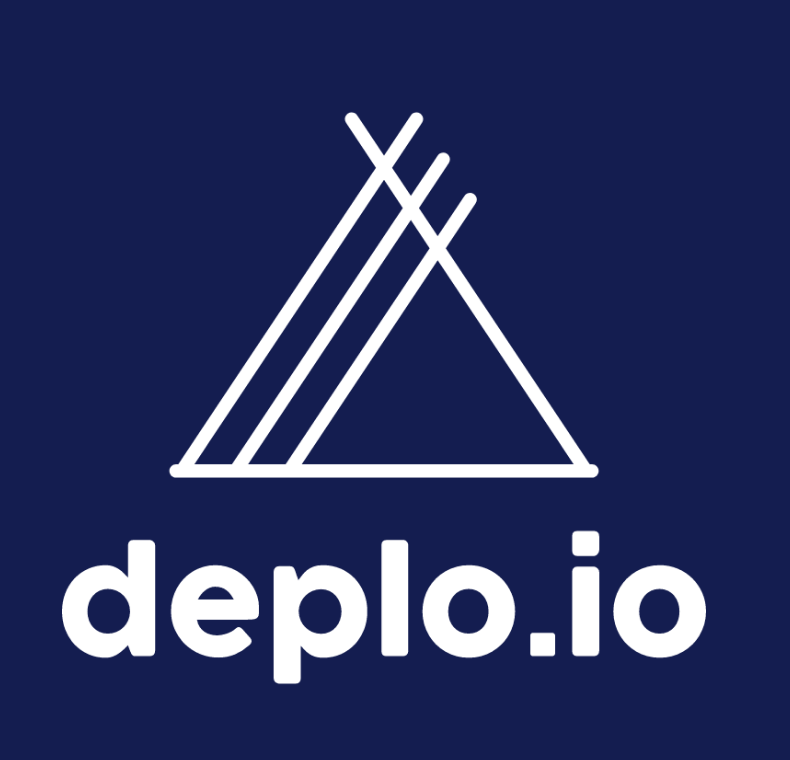
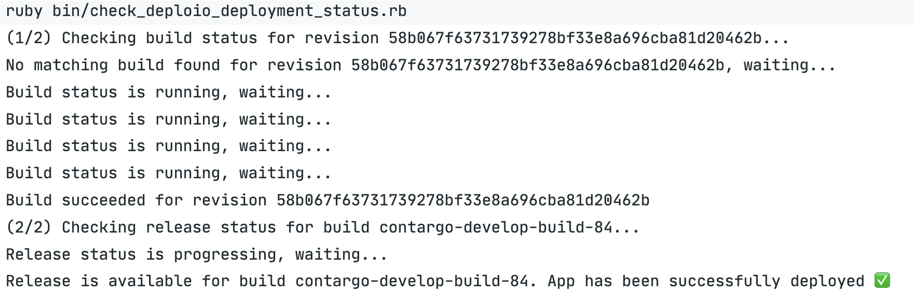

<!-- _class: renuo -->

# Deploio CD v2

How to check whether deployment was successful

##### 2024-11-01 by Simon I.

--- 

<!-- _class: renuo -->

<style scoped>
  h1 { text-align: center; font-size: 60px; }
</style>

# Recap

---

# Revision-based deployment

1. Local code is checked out
2. `nctl` CLI is installed & authenticated
3. Deploio revision is set to the latest commit of the current branch (in our case `develop`)

_develop-deploy.yml_
```yaml
...
nctl update app $DEPLOIO_APP_NAME 
    --project $DEPLOIO_PROJECT 
    --git-revision=$(git rev-parse develop) 
    --build-env="RUBY_VERSION=$(cat .ruby-version)" 
```

---

# Limitations

- (Service account per project required)
- No response from Deploio -> **state of build & release is unknown**

---

<!-- _class: renuo -->

<style scoped>
* {
  text-align: center;
}

img {
  margin: 30px 30px 0 0;
}
</style>

# Deploio x Semaphore v2

 

---

# 4th step: check for build and release status

1. Local code is checked out
2. `nctl` CLI is installed & authenticated
3. Deploio revision is set to the latest commit of the current branch (in our case `develop`)
4. **NEW:** Build and release status is being polled continuously to ensure the deployment was successful on Deploio (`bin/check_deploio_deployment_status.rb`)

---



---

# Previous limitations

- (Service account per project required)
- ~~No response from Deploio -> state of build & release is unknown~~

---

<!-- _class: renuo -->

# 

# Thanks

https://github.com/renuo/lightning-talks