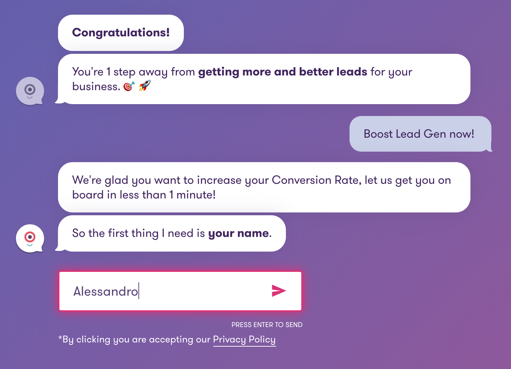

<!-- _class: renuo -->

# Landbot
## A No-code Messaging Management Platform

##### 2020-02-21 by Alessandro

---

# 

---

# Demo

---

# Considerations

Landbot follows the Anti-AI pattern.
It defies expectations with and intentionally simplified approach

---

# M - from Facebook

The chatbot reportedly only succeeded 30 percent of the time, and humans had to step in during the other instances.

---

# Google Duplex

Arguably the most advanced chatbot around today, is still limited to verifying business hours and making simple appointments.

---

# :angry:

Users expect far more than what AI chatbots can actually do, which tends to enrage them.

---

# I am a bot

Users don’t have to waste time thinking “Am I wording this question in a way the chatbot understands?” 
They can just click the button that corresponds to their response, then wait for Landbot’s next sentence.

---

# Pricing

https://landbot.io/pricing/

---

# Examples

https://voltagead.com/

---

<!-- _class: renuo -->

# 

* https://www.wired.com/story/facebooks-virtual-assistant-m-is-dead-so-are-chatbots/
* https://futurism.com/landbot-anti-ai-chatbot
* https://chatbotslife.com/how-landbot-is-defying-the-status-quo-for-chatbots-4a1a375796a9
* https://futurism.com/google-duplex-why-exist
* https://www.wired.com/story/xai-meeting-ai-chatbot/
* https://hackernoon.com/its-not-a-two-horse-race-for-voice-assistants-and-chatbots-ain-t-dying-b7081812d466

# Thanks!