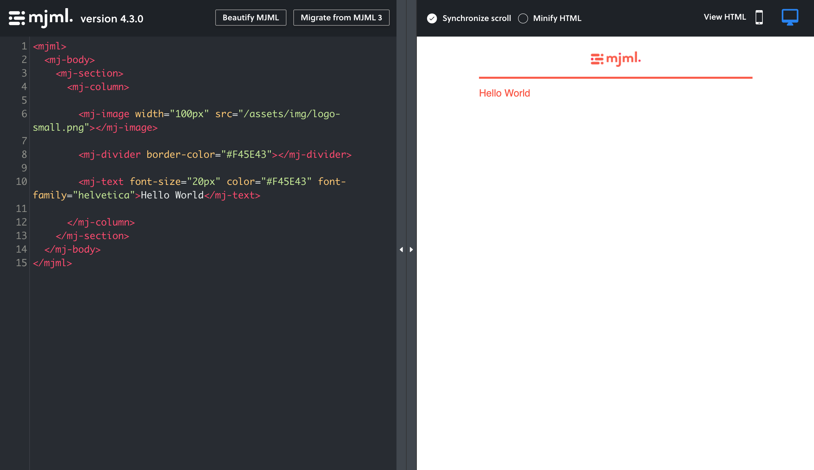
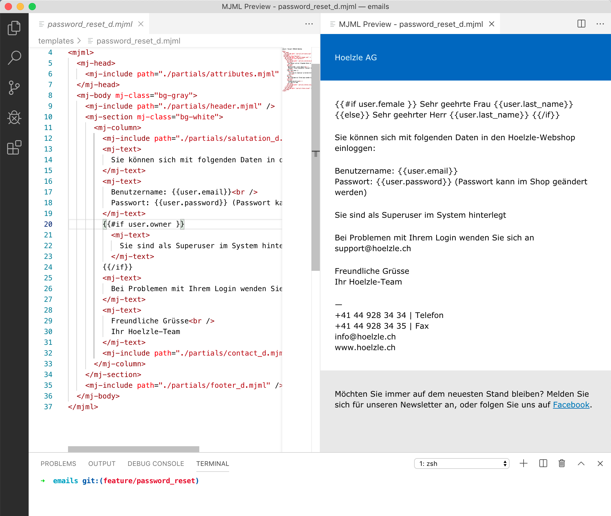

<!-- _class: renuo -->

# mjml
## A template language for responsive emails

##### 2019-10-? by Alessandro Rodi

---

# What problem(s) do I want to solve?

- Writing responsive emails is painful.
- Design nice emails is time-consuming.
- Test emails is difficult (?)

---

# Introducing mjml

Do you remember `marp`?
This is similar: a template language specific for emails.

---

# A simple example

```html
<mjml>
  <mj-body>
    ...
  </mj-body>  
</mjml>
```

---

# Sections and columns

```html
<mj-section>
  <mj-column>
    ...
  </mj-column>
  <mj-column>
    ...
  </mj-column>  
</mj-section>
```
---
# Text

```html
<mj-text>
  col1
</mj-text>
```
---

# Background image / Images

```html
<mj-section background-url="/assets/img/background-url.jpg">
<mj-image src="/assets/img/image.jpg"></mj-image>
```
---
# Buttons

```html
<mj-button> Click here! </mj-button>
```
---
# Tools

An online editor: https://mjml.io/try-it-live

# 

---

# Integration with VSCode

No integration for IntelliJ :cry:

# 
---

# Complete example

https://mjml.io/try-it-live/Bk--7Fjwr

---

# Templates

Some templates are already available:

https://mjml.io/templates

---

# How do I use it Rails?

`gem 'mjml-rails'`

`yarn add mjml`

```ruby
# config/initializers/mjml.rb

Mjml.setup do |config|
  config.template_language = :slim #default is :erb
end
```
---

<!-- _class: renuo -->

# 

## Enjoy writing emails! :tada:

### https://mjml.io/
### https://github.com/renuo/lighning-talks

# Thanks!