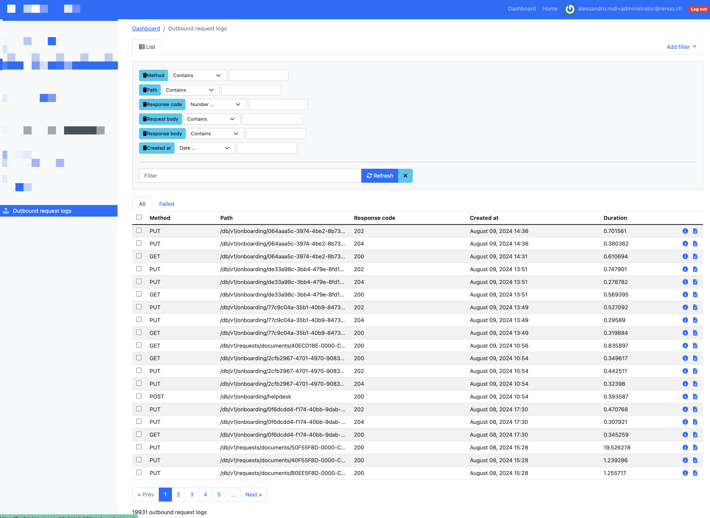
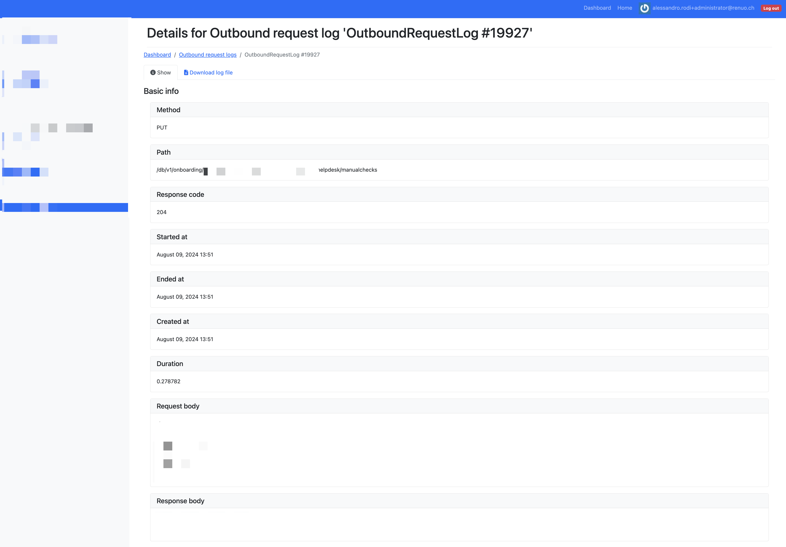
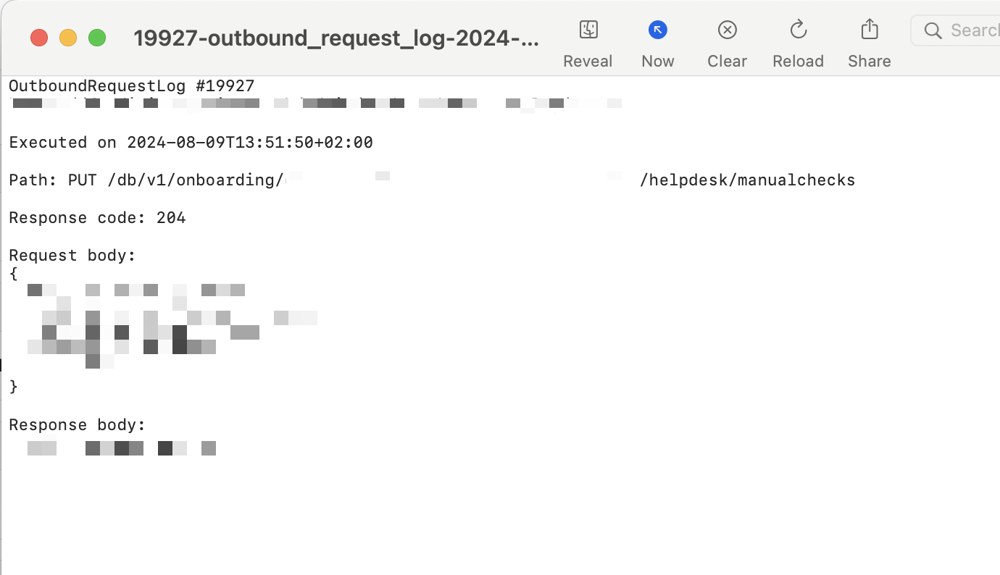
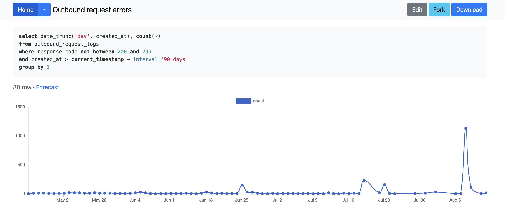
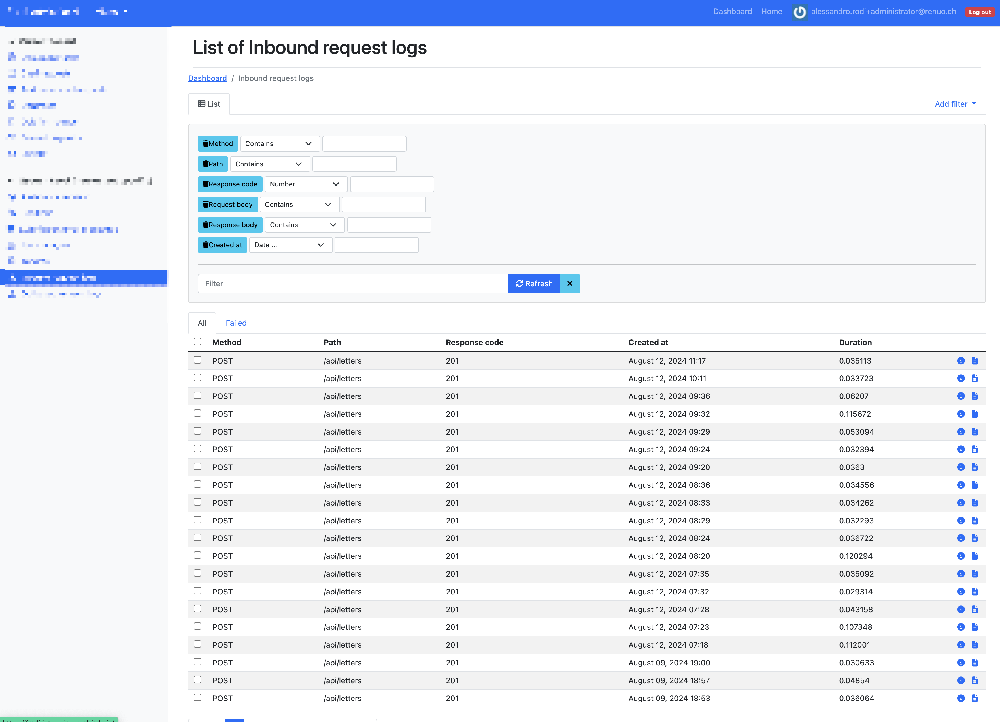
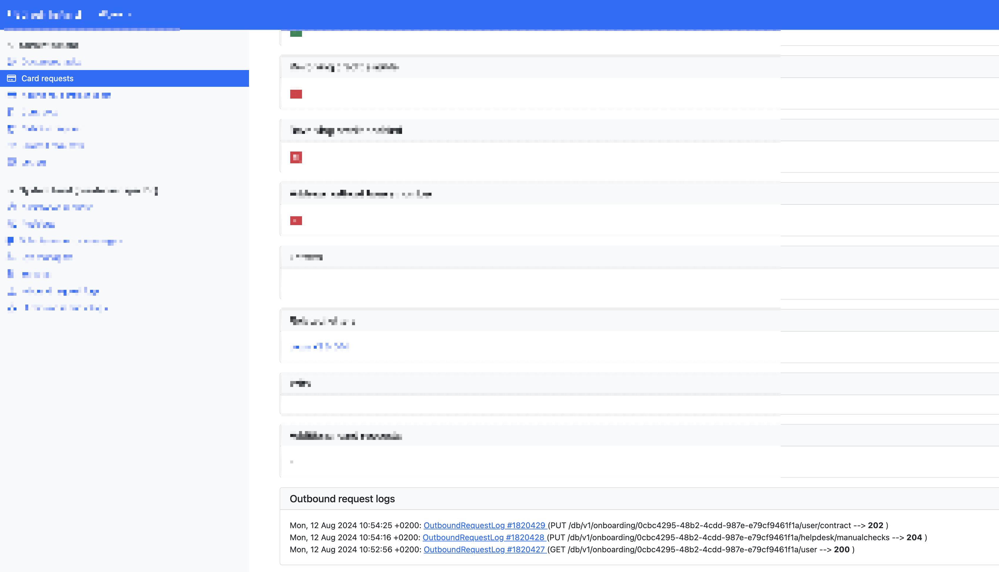
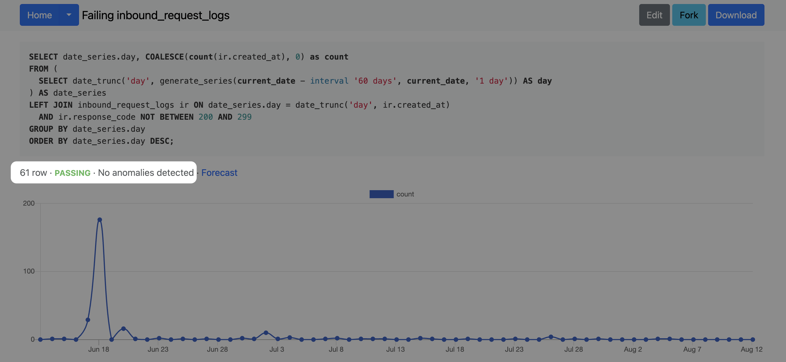
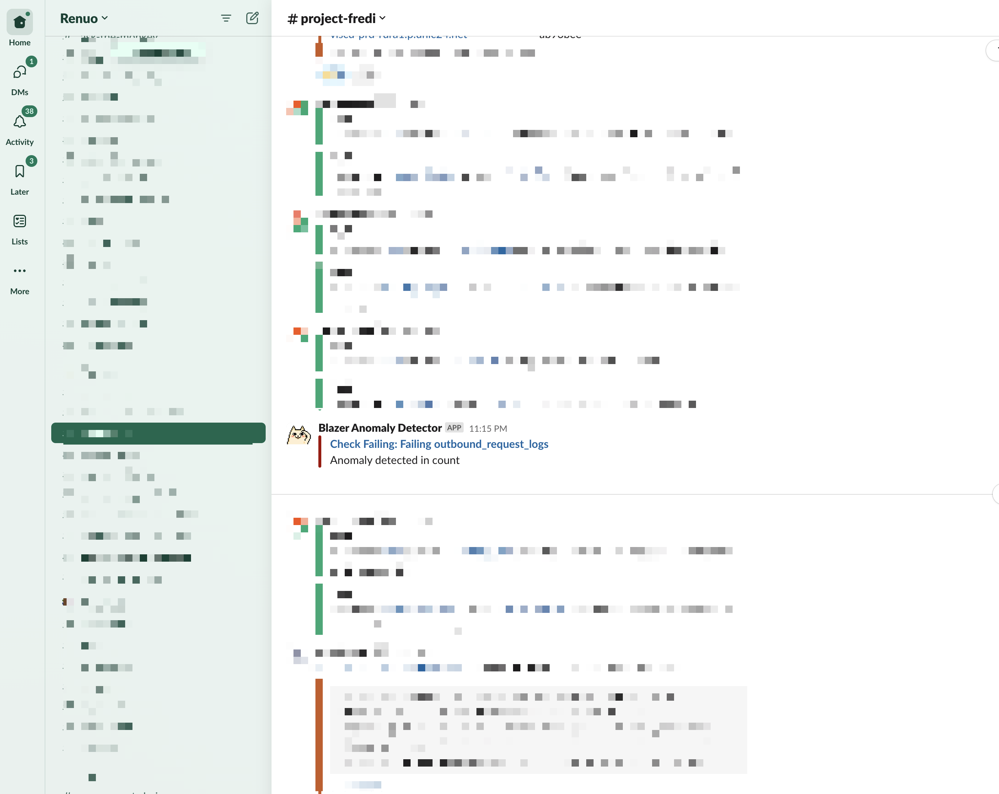

<!-- _class: renuo -->


# Pragmatic Rails - API Logger
## Keep track of API calls


Alessandro Rodi
Renuo AG

---


In applications that interact with multiple systems, keeping track of communications (API calls) is not only important but essential.

---

What happened there? 

---

Why did it fail? 

---

How come it is like that? 

---

Since when does it fail?

---

# Auditing

Auditing is really important when your app is part of a larger construct of applications.

---

# Monitoring

Do we have an anomaly in the number of calls, or in the number of errors?

---

# We need to log API calls and quickly find them in our system

`gem rails_api_logger`

It consists of two distinct parts: Outbound Requests Logger, Inbound Requests Logger.

---

# Outbound Requests Logger

```ruby
uri = URI('http://example.com/some_path?query=string')
http = Net::HTTP.start(uri.host, uri.port)
request = Net::HTTP::Get.new(uri)
response = http.request(request)
```

---

```ruby
# uri = URI('http://example.com/some_path?query=string')
# http = Net::HTTP.start(uri.host, uri.port)
# request = Net::HTTP::Get.new(uri)

log = OutboundRequestLog.from_request(request)

# response = http.request(request)

log.response_body = response.body
log.response_code = response.code
log.save!
```

---

```ruby
# uri = URI('http://example.com/some_path?query=string')
# http = Net::HTTP.start(uri.host, uri.port)
# request = Net::HTTP::Get.new(uri)

response = RailsApiLogger.new.call(nil, request) do
  # Net::HTTP.start(uri.host, uri.port, use_ssl: true) { |http| http.request(request) }
end
```

---

# 

---

# 

---

# 

---

# 


# Inbound Requests Logger

```ruby
config.middleware.insert_before Rails::Rack::Logger, InboundRequestsLoggerMiddleware
```

---

```ruby
config.middleware.insert_before Rails::Rack::Logger, InboundRequestsLoggerMiddleware, 
  only_state_change: false

```

---

```ruby
config.middleware.insert_before Rails::Rack::Logger, InboundRequestsLoggerMiddleware, 
  path_regexp: /api/
```

---

# 

---

# Attached, loggable, objects

Given an object/record, what API calls have been performed related to it?

# 

---

# Attach an object to inbound request logs

```ruby
def create
  @user = User.new(user_params)
  if @user.save
    attach_inbound_request_loggable(@user)    
  else
    ValidationError.track(@user) 
  end
end
```

---

# Attach an object to outbound request logs

```ruby
RailsApiLogger.new(@user)
```

---

# 

---

# 

---

<!-- _class: renuo -->

# 


### https://github.com/renuo/rails_api_logger

# Thank you