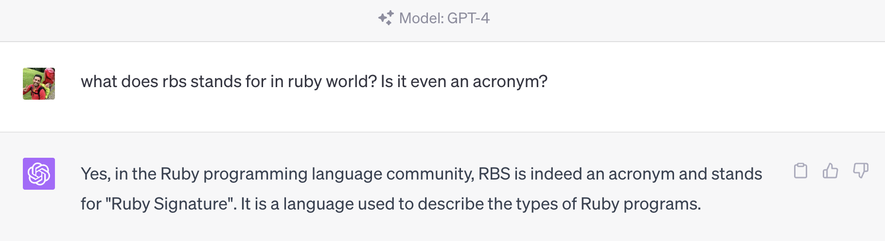
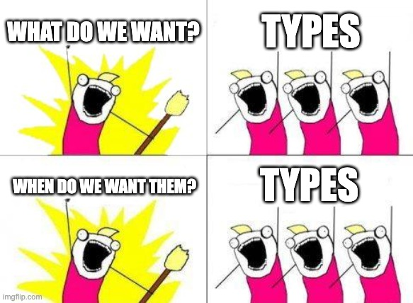

<!-- _class: renuo -->

# RBS Powerday @ Renuo
## One of the most unused ruby features at Renuo

##### 2023-06-28 by Alessandro Rodi

---

# Today's plan

Not a full powerday unless you want to continue after the official block.

* `09:30` -> `12:30` investigate and prepare presentations
* `12:30` -> `13:30` lunch
* `13:30` -> `((10 + 5) * NUM_GROUPS).minutes.after(13:30)` presentations

---

# What is RBS?

R...
B...
S...

---

# What is RBS?

# 

Regionalverkehr 
Bern-
Solothurn

---

# What is RBS?

# 

Royal
Bank of
Scothland


---


# What is RBS?

Ruby
B...
S...

---

# What is RBS?

Ruby
B...
System

---

# What is RBS?

Ruby
Bible
System

---

# What is RBS?

Ruby
Blasted
System

---

# What is RBS?

Ruby
Boring
System

---

# What is RBS?

Ruby
Bible
System

---

# What is RBS?

# 

Ru
by 
Signature

---

# Since when?

# 🎄
25.12.2020 

it's almost three years!

---

# Types!


> If Ruby On Rails is omakase, Ruby is *a la carte*.
-- Bozhidar

# 

---

# Example

```ruby
# my_class.rb

class MyClass
  def my_method(my_param)
    "#{my_param} rocks!"
  end
end
```

```ruby
# my_class.rbs
class MyClass
  def my_method : (my_param: String) -> String
end
```

---

# Separate files: d.ts ?

* You can define types only for the files you want
* You can partially type
* You can delete the `sig` folder at once

---

# Possible Excercises

* Investigate rbs and how the syntax looks like
* Split up in pairs. Some ideas:

* Integrate types in a gem
* Integrate types in a project
* Use types in Rubymine
* Use types in VSCode
* What are the differences between rbs and sorbet?
* What is steep? How do you use it?
* No rbs. I want to look into sorbet!
* rbs rails

---

# Prepare presentation

Prepare a 10 minutes presentation about your findings.

---

# Lunch together

During lunch we will be able to discuss further

---

# Present

Presentations after lunch.
Show what you discovered about the chosen topic.
Opinions. Pros and Cons.

---

<!-- _class: renuo -->

# Questions?

* https://github.com/ruby/rbs
* https://github.com/soutaro/steep
* https://github.com/sorbet/sorbet
* https://dev.to/honeybadger/understanding-rbs-ruby-s-new-type-annotation-system-29b9

# 
