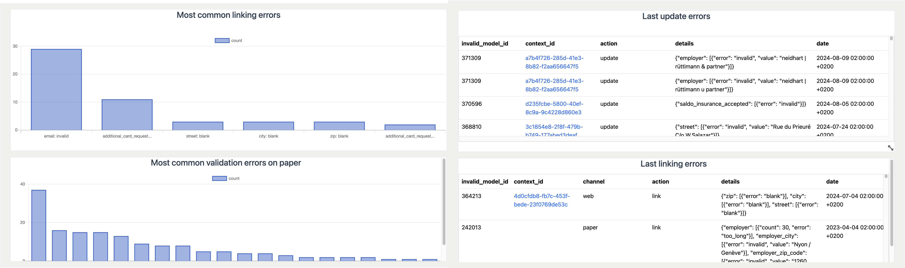

<!-- _class: renuo -->


# Pragmatic Rails - Validation Errors
## How to track them in your Ruby On Rails


Alessandro Rodi
Renuo AG

---

# A form

Image of a simple form with first name, last name, email, street and street number, city, zip code.

---

# Form submission

We submit the form and we get back from the server the validation errors.

---

# Form submission

```ruby
def create
    @user = User.new(user_params)
    if @user.save
        redirect_to @user
    else        
        render :new
    end
end
```

---

# Client-side validations

I like immediate feedback so I implement client-side validations.

---

# Am I missing something?

Client side validations and server side validations might mismatch.
This is all good, but we might want to improve the situation.
I want to know what I am missing. I want to know why my users get stuck.

---

# How to track?

## Logs

Good idea! (Best one) 
But we need to parse the logs and extract stats from them, and we might not have such a tool (yet).

---

# How to track?

## Sentry (or any error tracker)

Bad idea. Is not an error, right?

---

# Our own database

We can keep track of the validation errors in the database.


```ruby
def create
    @user = User.new(user_params)
    if @user.save
        redirect_to @user
    else
        track_errors(@user)
        render :new
    end
end
```

---

# Track validation errors

```ruby
def track_errors(model)
  ValidationError.create!(invalid_model: model, details: model.errors.details)
end
```

```ruby
 # details is a jsonb postgres column
 {"base" => [{"error" => "invalid"}],
  "title" => [{"error" => "blank"}, {"error" => "invalid"}]}
```

We keep the structure exactly as the `ActiveRecord::Errors` one.

---

# What now?

We want to know. We need statistics.

---

# Extract stats

We first generate a view to convert this `ValidationError`:


| id | invalid_model_name | invalid_model_id | details                                                                                               |
|----|--------------------|------------------|-------------------------------------------------------------------------------------------------------|
| 1  | Book               | 1                | `{ "base" => [{ "error" => "invalid" }], "title" => [{ "error" => "blank" }, {"error" => "invalid"}] }` |

---

# Extract stats

into this `FlatValidationError`:

| invalid_model_name | invalid_model_id | error_column | error_type |
|--------------------|------------------|--------------|------------|
| Book               | 1                | base         |  invalid   |
| Book               | 1                | title        |  blank     |
| Book               | 1                | title        |  invalid   |

---

# Count the number of errors per day

```sql
select count(*), date(created_at) 
from validation_errors 
group by date(created_at) 
order by date(created_at) desc;
```

<br><br>

```ruby
ValidationError.group_by_day(:created_at).count
```

---

# Count the number of errors per model and attribute

```sql
select invalid_model_name, error_column, count(*)
from flat_validation_errors
group by 1, 2
```

<br><br>


```ruby
FlatValidationError.group(:invalid_model_name, :error_column).count
```

---

# Statistics

# 

Made with [Blazer](https://github.com/ankane/blazer)

---

# validation_errors gem
*Because shit happens*

<br><br>

⭐️ 48 - Github

Extracted from real production apps.

---

# 

---

# validation_errors gem

```ruby
ValidationErrors.track(your_invalid_model)
```

<br><br>

```ruby
def create
    @user = User.new(user_params)
    if @user.save
        redirect_to @user
    else
        ValidationError.track(@user)
        render :new
    end
end
```

---

# validation_errors gem

```ruby
class User < ApplicationRecord
    track_validation_errors
end
```

<br><br>

```ruby
class ApplicationRecord < ActiveRecord::Base
    self.abstract_class = true
    track_validation_errors
end
```

---

# How do we use it?

### API
What are the most frequent validation errors? Improve the documentation?

### Web UI
Improvements to the UI

### Data import
Are there any mismatch between systems?

### Monitoring

Queries and alerts via Blazer / Monthly review.

---

<!-- _class: renuo -->

# 


### https://github.com/coorasse/validation_errors

# Thank you